# delivery-app
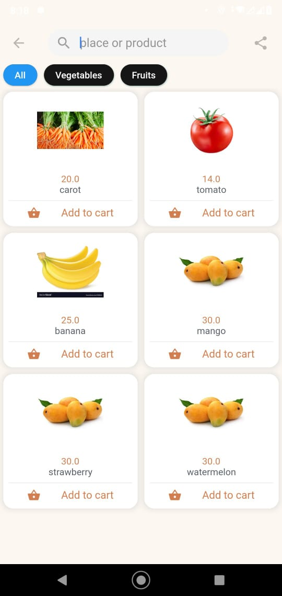 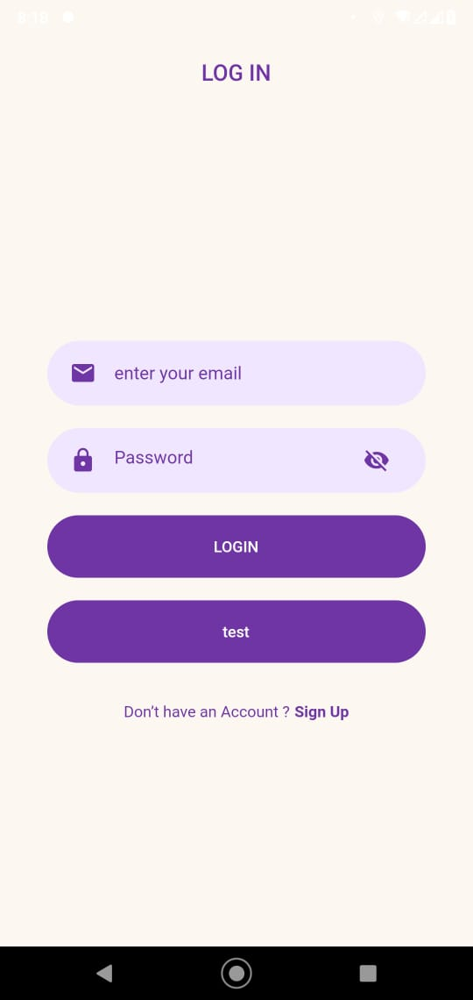 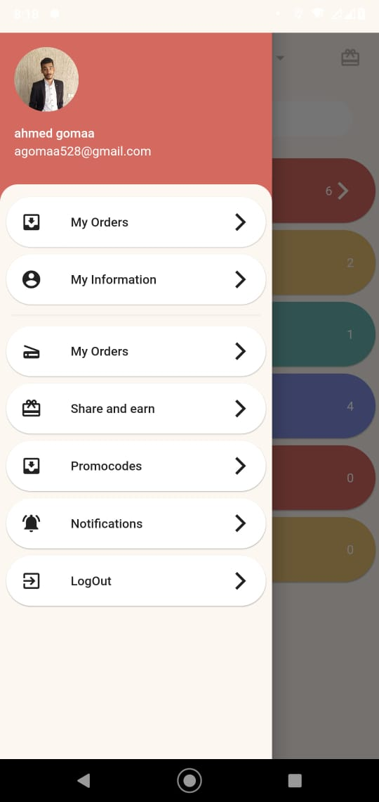 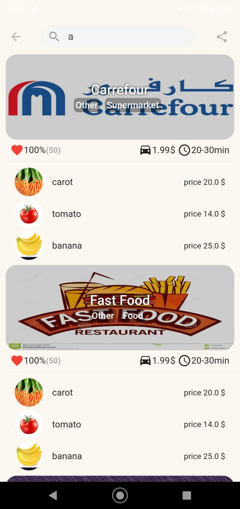 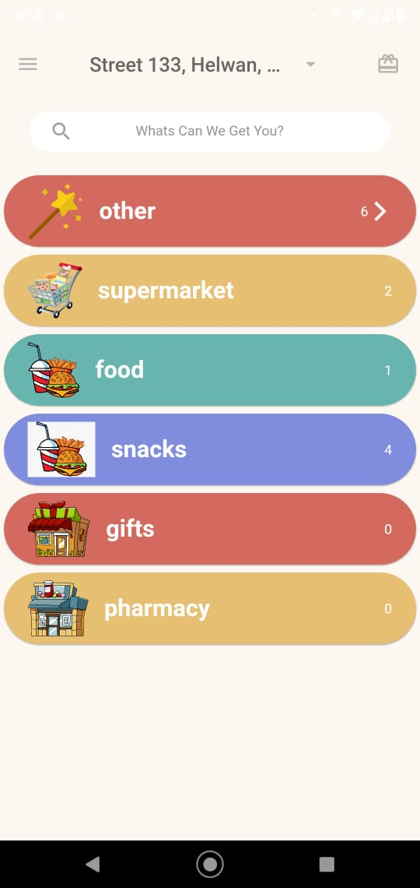 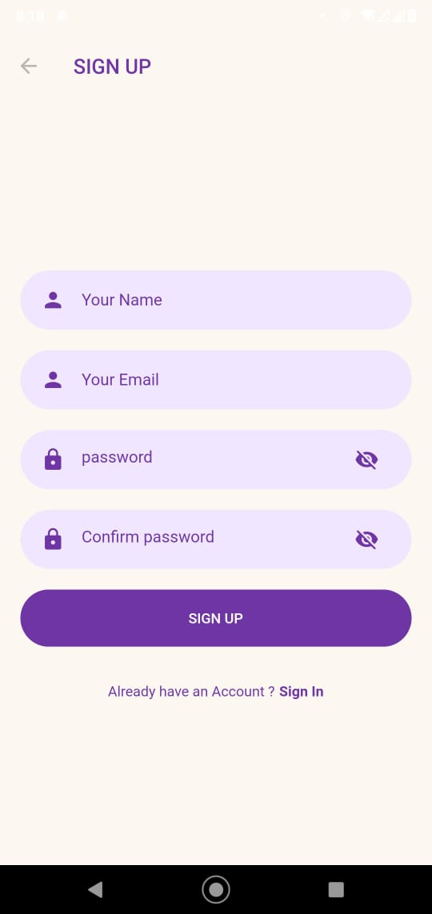 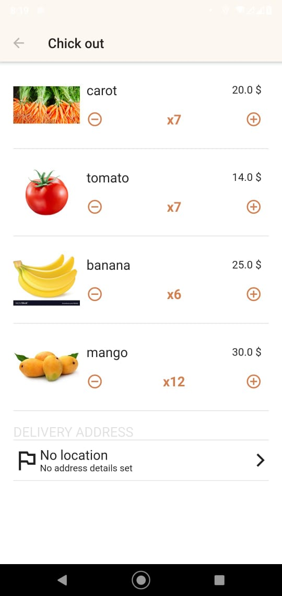 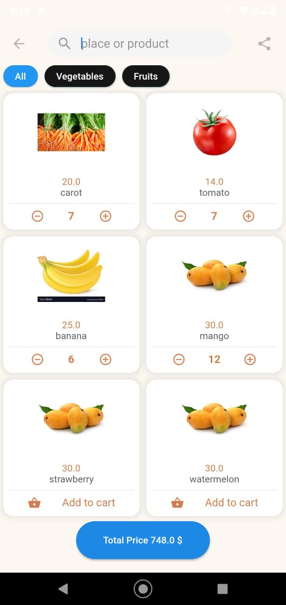 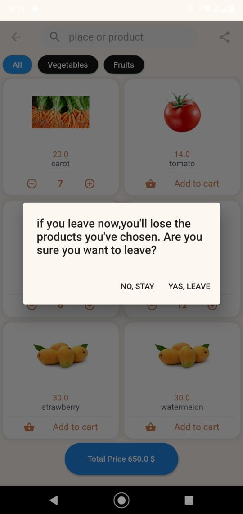 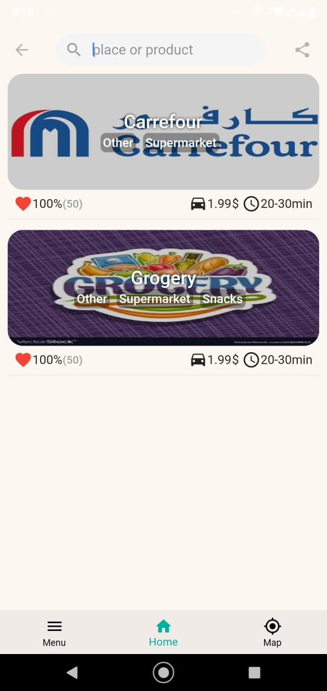 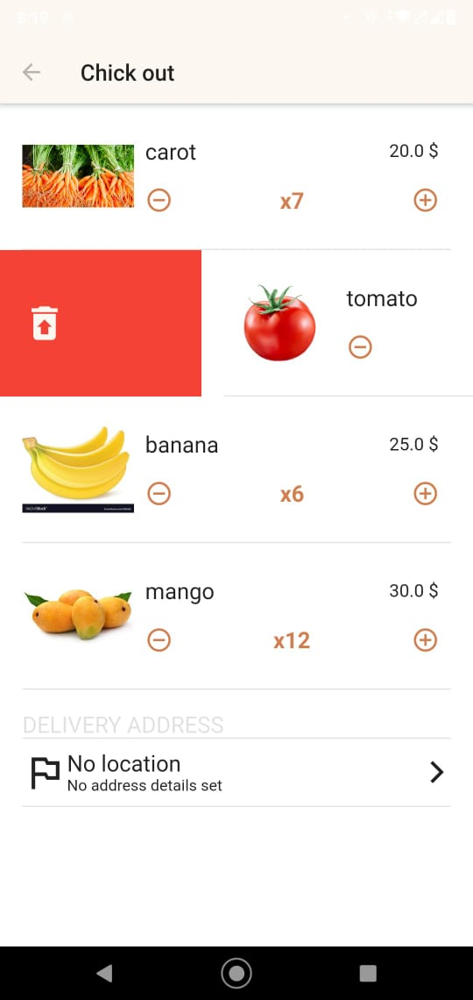 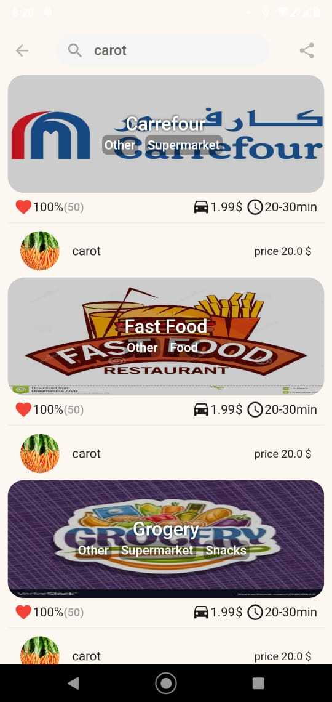

# packages
  geolocator: ^6.0.0+2
  google_maps_flutter: ^0.5.30
  flutter_staggered_grid_view: ^0.3.2
  geocoding: ^1.0.3
  geocoder: ^0.2.1
  firebase_core: ^0.5.0
  firebase_auth: ^0.18.0+1
  cloud_firestore: ^0.14.0+2
  provider: ^4.3.2+2
  image_picker: ^0.6.7+7
  permission_handler: ^5.0.1+1
  fluttertoast: ^7.0.4
  
# database
  useing firestore to crud products and stores and categorys

# pattern design
  mvvm architecture using provider to create view model layer 
  
# in future 
  i will uplode dashbord and delivery man app 
  complete unfinished screens and features
 
